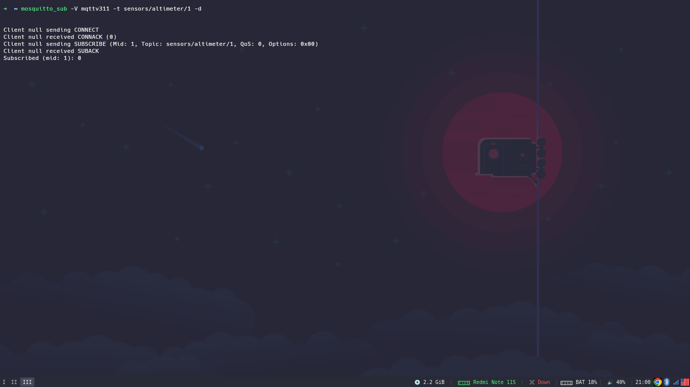
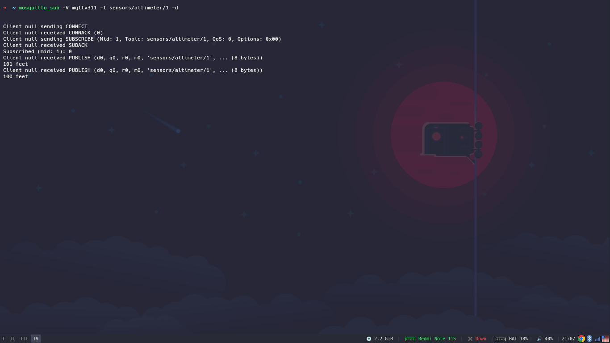
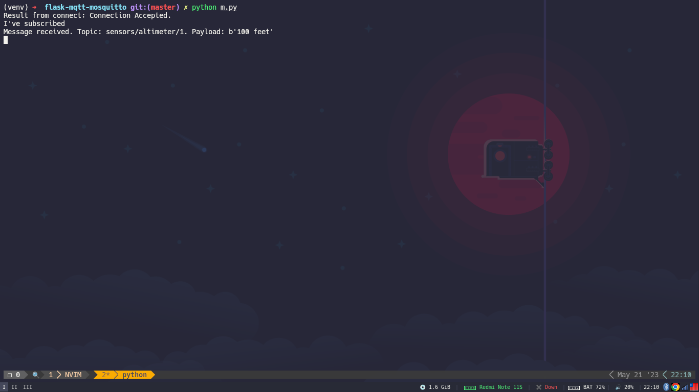

# Mosquitto with Flask

## Setup
Install this command using the following command for arch linux:
```bash
yay -S mosquitto
```
and if your using ubuntu:
```bash
sudo apt-add-repository ppa:mosquitto-dev/mosquitto-ppa
sudo apt-update
sudo apt-get install mosquitto mosquitto-clients
```
enable and run the mosquitto
```bash
sudo systemctl enable mosquitto.service
sudo systemctl start mosquitto.service
```
## Mosquitto Clients
Now we will get into how to subscribe and publish messages using command line tools.

Enter in the command prompt as follows to subscribe to the topic ‘sensors/altimeter/1

```bash
mosquitto_sub -V mqttv311 -t sensors/altimeter/1 -d
```

-V determines the mqtt version we are using, here we use 3.1.1. Then the topic comes after the -t. -d means debug mode, so we can view what happens under the hood.

Here we have used our localhost. If we want to use any other server we can do it by me including -h followed by the IP address or name of the server.

The output is as follows:


using this command we publish new message and then we can see the results in the output.
```bash
mosquitto_pub -V mqttv311 -t sensors/altimeter/1 -m "100 feet" -d
```
The difference from subscribing is instead of mosquitto_sub we have used mosquitto_pub and we have an additional -m to denote the message.

The output will be as follows:


## Subscribe and publish using python
Paho-mqtt-python is a Python implementation of MQTT and we will use python to subscribe and publish messages.
for installing paho:
```bash
pip3 install paho-mqtt==1.3.1
```

in `m.py` file we specify how to implement subscribe using paho-mqtt.
code explenation:
First of all, we import the client paho.mqtt.client as client.

Then we define the callback functions which will be called upon specific events.

Our first callback is on_connect function, which will be called when a client’s - either a subscriber or publisher-request has been accepted by the broker/server.

So this function takes in 4 arguments - client, userdata, flags, rc - which are the data that come along with the connection acknowledgement from the server. client is the existing client we have. userdata is self-explanatory and rc is the return code sent by the server.

Now we need to subscribe to the topic “sensors/altimeter/1” by writing down

client.subscribe("sensors/altimeter/1")

Later we will use this callback function when the client is connected with the server.

Our next callback function is on_subscribe function which is fired when the client is subscribed to a specific topic.
It has client, userdata, message id - mid, and granted_qos as the arguments. granted_qos tells us the QoS (Quality of Service) provided and since we only have one topic, so we take the first value of the granted_qos array.

Next callback function is on_message function, which is fired upon client receiving messages.

It has arguments as client, userdata, msg. msg is the message received by the subscriber from the server. msg.topic the topic of the message received and msg.payload is the actual message.

All the arguments need not be the names we have defined, but the format should be the same.

Now we will enter into the main function.

New client is created using paho.mqtt.client.Client We have specified in the MQTT protocol version as 3.1.1while instantiating a client object.

whenever a client makes a connection with the server, the client.on_connect method will be executed.

Then we will tell what should be executed if a client’s subscription has been approved by assigning our on_subscribe function to client.on_subscribe method.

Lastly, upon receiving a message client.on_message will be executed where we have assigned our on_message function.

Then we make the connection using client.connect and we specify the required positional parameter host="localhost". which i use my localhost as my brocker.

Then we run our loop forever by running loop_forever() function we want it to be run always in order to receive messages whenever published by publishers.

and for test if out `m.py` is working we simply just run the script with `python m.py` and run the following command:
```bash
mosquitto_pub -V mqttv311 -t sensors/altimeter/1 -m "200 feet" -d
```
We can see that the subscriber has successfully received the message.



and for create publishe script we use `p.py` file.

in the `p.py` file we have We have a variable named topic holding the topic name.

We publish a message to the broker/server using the following line of code.

`client.publish(topic=topic, payload="300 feet")`

We assign our topic variable to the topic parameter and payload parameter takes in our actual message.

for test to see if it work or not, first run the m.py and the run p.py.


## Resources
https://medium.com/@ashiqgiga07/mqtt-with-python-part-1-a38e64308c76
https://medium.com/@ashiqgiga07/mqtt-with-python-part-2-c202ae640f5c

